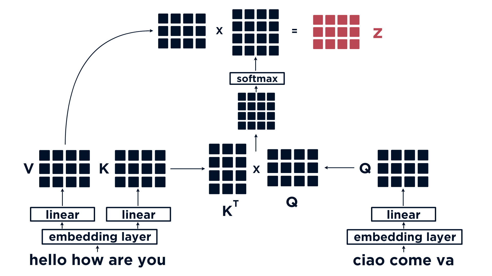

# NLP

***

# Section 1. NLP History and Current

***


## Word2Vec

* NLP Started with `word2vec` by Mikolov et al (https://arxiv.org/abs/1301.3781)
  * Typical vector dimension is 50 - 100
  * Method 1: `CBOW` (Continous bag of words): given the surrounding words context we predict the current words
  * Method 2: `SKIP-gram`: given the words we predict the surrounding words context
  * Applications:
    * Word similarity in the vector space
    * Document classification
  * `Doc2vec` as a variation
    * Uses the word2vec model, and added another vector (Paragraph ID)
    * two flavors:
      * `Distributed Memory version of Paragraph Vector` (PV-DM). It acts as a memory that remembers what is missing from the current context — or as the topic of the paragraph. While the word vectors represent the concept of a word, the document vector intends to represent the concept of a document.
      * similar to skip-gram may be used Distributed Bag of Words version of Paragraph Vector (PV-DBOW)
* Challenges: no direct way of evaluate the model since it is an unsupervised learning
  * One possible metric for word2vec, is a generalization of the above example, and is called analogical reasoning.
  
    ```
    happy happily — furious furiously
    immediate immediately — infrequent infrequently
    slowing slowed — sleeping slept
    spending spent — striking struck
    ```
    [Ref Dataset for analogical reasoning](http://download.tensorflow.org/data/questions-words.txt)
  
  * A success in this task is getting very close results when caclulating distances (cosine) between matching pairs.
  * Doc2vec was tested in the article on 2 tasks: the first is sentiment analysis, and the second one is similar to the analogical reasoning

*** 

## RNN

* RNN
  * The architure is a natural fit for language modeling
    * seq to seq (many in many out)
    * seq to vector (many to one)
    * vector to seq (one to many)
  * Major issue is Vanish/Exploding Gradient problem
    * Vanishing: if error of network is too small, it propergate and becomes much small for the network to learn
    * Exploding: if weight is too large, it will grow exponentially, the network will oscillate without learning
    * ReLU and variation of ReLU can help to reduce vanishing gradient because it does not exponentially decrease the rate of change as sigmoid
    * Batch norm is another way to alleviate vanishing gradients
    * Better initialization

*** 

## LSTM (Long Short Term Memory) (similar to GRU)


* Architeture: Using gate (which is sigamoid activation (or tanh) to remove, update or add information from input to output)
  * forget gate (1st bottom): it is used to throw away information from the previous hidden state and pass to the current cell state (sigmoid)
  * input gate (2nd bottom):  it is used to update the input information (signmod x tanh)
  * cell state (top horizontal): either dropping vales in the cell state or add/update cell state with new value
  * output gate: determine the next hidden state (sigmoid x tanh(cell state))
  * Summary: the forget gate decides what is relevant to keep from prior steps. The input gate decides what information is relevant to add from the current cell state. The output gate determines what the next hidden state should be.
    * Note: Sigmoid $\in [0, 1]$ can remove information, tanh $\in [-1, 1]$ can change polarity of the information
* LSTM math form
For each element in the input sequence, an LSTM layer computes the following functions:<br>
$\begin{array}{ll} \\
    i_t = \sigma(W_{ii} x_t + b_{ii} + W_{hi} h_{(t-1)} + b_{hi}) \\
    f_t = \sigma(W_{if} x_t + b_{if} + W_{hf} h_{(t-1)} + b_{hf}) \\
    g_t = \tanh(W_{ig} x_t + b_{ig} + W_{hg} h_{(t-1)} + b_{hg}) \\
    o_t = \sigma(W_{io} x_t + b_{io} + W_{ho} h_{(t-1)} + b_{ho}) \\
    c_t = f_t * c_{(t-1)} + i_t * g_t \\
    h_t = o_t * \tanh(c_t) \\
\end{array}$

  where $h_t$ is the hidden state at time $t$, <br>
  $c_t$ is the cell state at time $t$, <br>
  $x_t$ is the input at time $t$, <br>
  $h_{(t-1)}$ is the hidden state of the layer at time $t-1$ or the initial hidden state at time $0$, and <br>
  $i_t, f_t, g_t, o_t$ are the input, forget, cell, and output gates, respectively.<br>
  $\sigma$ is the sigmoid function, and $*$ is the Hadamard product.
* LSTM improves upon naive RNN with more stable passage of information (reduce vanish/exploding graduent)
  * Total params in general should be in the same magnitude of words or chars depending on the approach
  ***

## Encoder-decoder Attention network with LSTM

Referece: https://www.youtube.com/watch?v=quoGRI-1l0A&list=PLiWO7LJsDCHcpUmL9grX9WLjyi-e92iCO&index=12&ab_channel=DeepLearningAI


* The precursor of transformer archecture
* The atention mechanism is inspired from laugnuage translation problem 
* Architecture: encoder-decoder network expands LSTM network with addition hidden state, and NN layers
  * Allowed the output layers of a model to not only receive the final-state of the RNN units — but to also receive information from every state of the input layer, creating an ‘attention’ mechanism.
  * With this approach we find that similarity between the encoder and decoder states will result in a higher weight


* To train encoder self-attention network: 
  * Use three tensors, the Query, Key, and Value are used in the attention operation. The Query is pulled from the hidden state of the decoder at every time-step — alignment between this and the Key-Value tensors is assessed to produce the context vector.
  * The context vector is the sum output of attention network before feeding to the output layer
  * The context vector is then passed back into the decoder where is used to produce a prediction for that time-step. This process is repeated for every time-step in the decoder space
  * If this is a translation problem. Input is the sentence to be translated, output is translated sentence. Weights of the attention network is the hotspot on the headmap above


***

## Attention is all you need (Next evolution on Attention Network)

* The most important paper (https://arxiv.org/abs/1706.03762) that started the transformer evolution. 
  * Defines Solo attention (self-attention)
  * RNN and convolution is no longer needed (as in the previous section)
* Key building block that enables the new attention network:
  * **Self-attention**: attention within a sentence, it allows us to remove Query (from decoder) so that it can generated directly from input value (encoder), creates better allignment different part of input sequence since Q, K, V are all produced from inputs, produces much more meaningful numerical vectors. It allows the attention mechanism to encode relationships between all of the words in the input data.
  * **Multi-head attention**: multiple attention heads, create multiple representation of attention encoding: multiple self-attention in parallel. The outputs of these multiple heads are concatenated together. The parallel mechanism allowed the model to represent several subspaces of the same sequence. These different levels of attention were then concatenated and processed by a linear unit.

  

  * **Positional encoding**: input the attention network is no longer sequential (as RNN or LSTM network), it is in parallel, therefore we need additional encoding to show the position of the words, but we want to make sure it does not overweight the sematic position in the vector space. The approach:
    * position encoding is added to word embedding
    * Using sinusoidal function so the value is bounded (-1, 1): produce a different sinusoidal function for every dimension in the embedding dimension. The following fomulars produce the alternativing positional encoding values

    $$ PE_{(pos, 2i)} = sin(\frac{pos}{10000^{\frac{2i}{d_{model}}}}) $$
    $$ PE_{(pos, 2i+1)} = cos(\frac{pos}{10000^{\frac{2i}{d_{model}}}}) $$

    where `pos` is the word position , `i` is embedding dimension, and `d_model` is the number of embedding dimensions. 
    * Using embedding dimension to add graunlarity of the position encoding (with sinusoidal of decreasing frequency) i.e. Each index of the vector is assigned an alternating sine-cosine-sine function (index 0 is sine, index 1 is cosine). Next, as the index value increases away from zero towards d (the embedding dimensionality) the frequency of the sinusoidal function decreases
    * This encoding then added the word embedding
    * Note:  both the word embedding dimensionality and positional encoding dimensionality must match.

* Transformer language model uses only decoder (e.g. GPT3, GPT2), other transformer based tasks use encoder or both (e.g. BERT)
* [Reference Deep-dive](https://jalammar.github.io/illustrated-transformer/)

***

## Transformer Architecture and Applications


* Architecture highlights:
  * Position encoded input vectores
  * mutli-head attention network
  * encoder / decoder
    * Encoder contains self-attention + feed-forward network
    * Decoder contains self-attention + encoder-decoder-attention + feed-forward network
  * Additional NN
  * Optional self-attention network (where decoder is no longer needed)
* Transformer based modules (such as BERT), we can customize by adding other layers around BERT to fit our tasks
  * MLM (Masked Language Modeling)

  

    * Text will be fet in with a set of masked tokens for BERT to guess
    * Use for training language model to predict the probability of each words
    * text with masked token => Bert => Linear layer (alignment calculation) + softmax => Argmax
  * Classification
    * Similar to MLM, difference is in the output layer where instead of predict the probabilies of the words, we predict classes
    * text => Bert => Linear layer (alignment calculation) + softmax => classes
  * QA (Question and Answer)

  

    * Feed a questions along with a context which contains the answer, output a start token and end token that marks the position of the answer in the context
    * questions + conext => bert => 2 parallel linear layer(alignment calculation) + softmax => argmax-start-token, argmax-end-token

***

# Section 2. Preprocessing

***

## Clean Stopwords

* Some words only adds noise to the text data. They can be removed
* To remove stopwords, we often use `NLTK` package or `spaCy` package

  * NLTK Example

    ```python
    from nltk.corpus import stopwords

    stop_words = stopwords.words('english')
    stop_words = set(stop_words)
    cleaned_text = [word for word in text if word not in stop_words]
    ```

  * spaCy Example

    ```python
    import spacy

    nlp = spacy.load('en_core_web_sm')
    print(nlp.Defaults.stop_words)

    # Check if a yes is a stop word
    nlp.vocal['yes'].is_stop

    # To add a stop word
    nlp.Defaults.stop_words.add('btw')

    # Clean stop words
    stop_words = nlp.Defaults.stop_words
    cleaned_text = [word for word in text if word not in stop_words]
    ```

## Tokenization

* Single unit of text
  * a word
  * part of word
  * a single character
  * puntuation mark
  * special token (\<URL\>, \<PAD\>, \<NAME\>)
  * model specific tokens ([CLS], [SEP]) for BERT

* Use tokenizer functions or `split()` => naive
* Use `spaCy` => great package but can be slow

  ```python
  import spacy

  nlp = spacy.load('en_core_web_sm')

  # Tokenizer
  doc = nlp(mystring)
  num_of_tokens = len(doc)
  ```

* NOTE: `spaCy` has the sophesticated approaches that will isolate punctuation that does not form an integral part of a word.
  * Quotation marks, commas, and punctuation at the end of a sentence will be assigned their own token. 
  * Punctuation that exists as part of an email address, website or numerical value will be kept as part of the token.
  * Punctuation that exists as part of a known abbreviation will be kept as part of the token.


## Stemming and Lammatization

* They are text normliaztion methods used in NLP to simplify text before it is processed by a model
  * Stemming break the final few characters of a word
  * lemmatization reduces inflections down to their real root words, which is called a lemma.
  * Lemmatization is superior than stemming
* How to use
  * stemming
    ```python
    from nltk.stem import PorterStemmer, LancasterStemmer

    porter = PorterStemmer()
    lancaster = LancasterStemmer()

    stemmed = [(porter.stem(word), lancaster.stem(word)) for word in words_to_stem]

    print("Porter | Lancaster")
    for stem in stemmed:
        print(f"{stem[0]} | {stem[1]}")
    ```
  * lemmatization
    ```python
    import nltk
    nltk.download('wordnet')
    from nltk.stem import WordNetLemmatizer
    from nltk.corpus import wordnet

    lemmatizer = WordNetLemmatizer()

    [lemmatizer.lemmatize(word, wordnet.VERB) for word in words]
    ```
  Note: sPacy package perform lemmatization automatically

## Normalization

* Unicode normalization is used to normalize different but similiar characters.
* Compatibility equivalence refers to the formatting differences between characters, which includes (but is not limited to):
  * font variants
  * cursive forms
  * circled characters
  * width variation
  * size changes
  * rotation
  * superscript and subscript
  * fractions
* Normalization:
we use unicode normalization to *normalize* our characters into matching pairs. As there are different forms of equivalence, there are also different forms of normalization. These are all called **N**ormal **F**orm, and there are four different methods:

  | Name | Abbreviation | Description | Example |
  | --- | --- | --- | --- |
  | Form D | NFD | *Canonical* decomposition | `Ç` → `C ̧` |
  | Form C | NFC | *Canoncial* decomposition followed by *canonical* composition | `Ç` → `C ̧` → `Ç` |
  | Form KD | NFKD | *Compatibility* decomposition | `ℌ ̧` → `H ̧` |
  | Form KC | NFKC | *Compatibility* decomposition followed by *canonical* composition | `ℌ ̧` → `H ̧` → `Ḩ` |

* Python Example
  * `unicodedata.normalize()` to decode
  * `unicodedata.normalize().encode('utf-8')` to encode

  Examples:
  ```python
  # To decode
  unicodedata.normalize('NFD', c_with_cedilla)
  unicodedata.normalize('NFc', c_with_cedilla)
  unicodedata.normalize('NFKD', 'ℌ') # get H 

  # To encode
  unicodedata.normalize('NFKD', "\u210B\u0327").encode('utf-8')
  unicodedata.normalize('NFKC', "\u210B\u0327").encode('utf-8')
  ```

***
# Section 3. Topic Modeling
***

Traditionally we use statistical approach for topic modeling, the approaches are:

* LDA
* NMF
  
## Latent Dirichlet Allocation (LDA)

* LDA is a unsupervised ML method to extract topic from corpus 
* The Dirichlet model describes the pattern of the words that are repeating together, occurring frequently, and these words are similar to each other.
  * This stochastic process uses Bayesian inferences for explaining “the prior knowledge about the distribution of random variables”
* LDA generates probabilities for the words using which the topics are formed
* Assumptions:
  * Documents are a mixture of topics
  * Topics are a mixture of tokens (or words)
* **Key Takeaway**: The documents are known as the probability density (or distribution) of topics and the topics are the probability density (or distribution) of words.**

Example:

```python
# read data
import pandas as pd
npr = pd.read_csv('npr.csv')

# Text feature extraction
from sklearn.feature_extraction.text import CountVectorizer

cv = CountVectorizer(max_df=0.95, min_df=2, stop_words='english')
dtm = cv.fit_transform(npr['article])

# Fit data into 7 topics
from sklearn.decomposition import LatentDirichletAllocation
LDA = LatentDirichletAllocation(n_components=7,random_state=42)
LDA.fit(dtm)

print(len(LDA.components_)) # will return 7

# print top words for each topics
for index,topic in enumerate(LDA.components_):
    print(f'THE TOP 15 WORDS FOR TOPIC #{index}')
    print([cv.get_feature_names()[i] for i in topic.argsort()[-15:]])
    print('\n')

# Get topic labels and label to the text data
topic_results = LDA.transform(dtm)
npr['Topic'] = topic_results.argmax(axis=1)
```

## Non-Negative Matrix Factorization (NMF)  

* NMF is a unsupervised ML method to extract topic from corpus (analogous to PCA)
* It is a linear algebra method

Example:

```python
from sklearn.feature_extraction.text import TfidfVectorizer
tfidf = TfidfVectorizer(max_df=0.95, min_df=2, stop_words='english')
dtm = tfidf.fit_transform(npr['Article'])

from sklearn.decomposition import NMF
nmf_model = NMF(n_components=7,random_state=42)

# print top words for each topics
for index,topic in enumerate(nmf_model.components_):
    print(f'THE TOP 15 WORDS FOR TOPIC #{index}')
    print([tfidf.get_feature_names()[i] for i in topic.argsort()[-15:]])
    print('\n')

topic_results = nmf_model.transform(dtm)    
npr['Topic'] = topic_results.argmax(axis=1)
```

## LDA vs NMF

LDA

* Assumes each document has multiple topics.
* Works best with longer texts such as full articles, essays, and books.
* Evolves as you process new documents with the same model.
* Results are not deterministic, meaning you might get different results each time for the same data set.

NMF

* Calculates how well each document fits each topic, rather than assuming a document has multiple topics.
* Usually faster than LDA.
* Works best with shorter texts such as tweets or titles.
* Results are deterministic (I think), having more consistency when running the same data.

***
# Section 3. Attention Deep-Dive
***

## Attention mechanisms

* Type of attention mechanisms
  * Dot-product (encoder-decoder) attention
  * self-attention
  * Bidirectional attention
  * Multi-head attention

  
 
### Dot-product attention (encoder-decoder)

When we perform many NLP tasks we would typically convert a word into a vector (*word2vec*), with transformers we perform the same operation. These vectors allows us to represent meaning numerically (e.g days of the week may be clustered together, or we can perform logical arithmetic on the vectors - *King - Man + Woman = Queen*).

Because of this, we would expect sentences with similar meaning to have a similar set of values. For example, in neural machine translation, the phrase *"Hello, how are you?"*, and the Italian equivalent *"Ciao, come va?"* should share a similar matrix representation.

Now, when we iterate through each word, and compare the individual vectors between the two sequences - we should find that words such as *"Hello"* and *"Ciao"* have higher similarity than words that have different meaning such as *"are"* and *"Ciao"*.

  

* Steps: 
  * Convert a word into word2vec
  * perform **alignment** calculation typically using dot product (or cosine similarity)

    $$ u \cdot v = \vert u \vert \vert v \vert cos \theta = \sum_{i=1}^{n}a_n b_n $$


    Example

    ```python
    import numpy as np

    a = np.array(hello)
    b = np.array(Ciao)
    c = np.array(how)

    sim_ab = np.matmul(a, b.T)
    sim_ac = pp.matmul(a, c.T)
    sim_bc = np.matmul(b, c.T)
    ```

  * In dot-product attention, there are three tensors that we will be comparing. The query **Q**, key **K**, and value **V**. **K** and **V** are usually the same and are derived from the English text, Q is another tensor which is derived from the Italian text (for example).
    * The first thing we do is calculate the alignment vector between our English and Italian sequences, **K** and **Q** using the dot product.
    * Once we calculate the dot product, we apply a softmax function to convert the dot product alignment into probabilities. These are then multiplied by *V* to give us the attention tensor **z**.
    $$ Z = V \cdot softmax(K^T \cdot Q) $$

    

  * This summerize the math behind dot-product attention tensor creation

### Self-attention

* Similar to dot-product attention but using one input
* we compare words to previous words in the same sequence. So, where with dot-product attention we took our queries **Q** and keys **K** from two different sequences, self-attention takes them from the same sequence. Transformer models that look at previous tokens and try to predict the next include both text generation, and summarization.
  * **Q** and **K** from the same sequence
  * Apply a mask before softmax to remove all values calculated for future words. We only use dot-product between past words.
  $$ Z = V \cdot softmax(mask\_future(K^T \cdot Q)) $$

  
  * This summerize the math behind self-attention tensor creation

### Bi-directional (self) attention

* Self-attention without masking the future words
* This is particularly useful for masked language modeling - and is used in BERT (Bidirectional Encoder Representations from Transformers) - bidirectional self-attention refers to the bidirectional encoder, or the BE of BERT.
  

### Multihead Attention (used in BERT)

* build several representations of bidirectional attention between words - so rather than calculating attention once, we calculate it several times, concatenate the results, and pass them through a linear layer. In a transformer model
  * Same input but mulitple heads
  * bi-directional attention step with a scaling factor $d_k$ is equal to the dimension of **QKV** vectors (note: Q is query, K is key, V is value)
  * Concat output
  * Add an additional linear layer ($w_0$) to convert back to the right dimension

  

* The self attention layers in the decoder operate in a slightly different way than the one in the encoder: In the decoder, the self-attention layer is only allowed to attend to earlier positions in the output sequence. This is done by masking future positions (setting them to -inf) before the softmax step in the self-attention calculation.

***
# Section 4. Language Classification Tasks
***

## Sentiment Analysis (Document classification is similar just with different labels)

* It consists of a language classification task where our goal is to classify positive, negative, and neutral sentiments. Given the following three statements we would aim to identify whether each is good, bad, or neutral
* Steps:
  1. Raw text data is tokenized (converted into numerical IDs that map that word to a vector representation of the same word)
  2. Token IDs are fed into the sentiment model
  3. A set of values are output, each value represents a class, and the value represents probability of that being the correct sentiment class, from zero (definitely not) to one (definitely yes).
  4. The argmax of this output array is taken to give us our winning sentiment classification.

### Flair

* Flair offers models that we can use out-of-the-box. One of those is the English sentiment mode. Flair uses PyTorch/TensorFlow in under the hood, so it's essential that you also have one of the two libraries (or both) installed. There are a few steps in applying sentiment analysis, these are:
  1. Initializing the model.
  2. Tokenizing input text.
  3. Processing with the model.
  4. *(Optional) Formatting the outputs.*
  5. Example

  ```python 
  import flair
  text = "I hate it when I'm not learning"
  model = flair.models.TextClassifier.load('en-sentiment')
  sentence = flair.data.Sentence(text)
  model.predict(sentence)
  sentence.get_labels() # [NEGATIVE (0.9991)]
  score = sentence.get_labels()[0].score # score get 0.9991
  value = sentence.get_labels()[0].value # value get NEGATIVE
  ```

### Transformers (use as a black box) with Publically available HuggingFace Transformer Library

* Huggingface Presently the most advanced and accessible library for building and using transformer models
* To apply sentiment analysis using the transformers library, we first need to decide on a model to use - as we will be applying a pretrained model, rather than starting from scratch. The list of models available can be found at [huggingface.co/models](https://www.huggingface.co/models).
* From the model page we select the **Text Classification** filter on the left of the page to filter for models that we can apply for text classification tasks immediately. For example, if we performing sentiment analysis on posts from */r/investing* (in this section we will be using the example given in `txt` below), which are finance oriented, so we can use the [finBERT](https://arxiv.org/abs/1908.10063) model [`ProsusAI/finbert`](https://huggingface.co/ProsusAI/finbert) which has been trained on financial articles for financial sentiment classification.
* Steps of using the huggingFace
  * Select a pretrained model that fits the needs of the use cases
  * tokenize our input text using BERT Tokenizer
  * Tokenized inputs are fed into the model, which outputs final layer activations (note activations are not probabilities).
  * Convert those activations into probabilities using a softmax function (sigmoid for multiple classes).
  * Take the argmax of those probabilities.
  * (Optional) Extract the probability of the winning class.

#### Notes on BERT Tokens

BERT Speical Tokens
| Token | ID | Description |
| --- | --- | --- |
| [PAD] | 0 | Used to fill empty space when input sequence is shorter than required sequence size for model |
| [UNK] | 100 | If a word/character is not found in BERTs vocabulary it will be represented by this *unknown* token |
| [CLS] | 101 | Represents the start of a sequence |
| [SEP] | 102 | Seperator token to denote the end of a sequence and as a seperator where there are multiple sequences |
| [MASK] | 103 | Token used for masking other tokens, used for masked language modeling |

### Apply huggingface BERT model for sentiment analysis on `/r/investing`

  ```python
  from transformers import BertForSequenceClassification, BertTokenizer
  import torch.nn.functional as F
  import torch

  # initialize the tokenizer for BERT models
  tokenizer = BertTokenizer.from_pretrained('ProsusAI/finbert')
  # initialize the model for sequence classification
  model = BertForSequenceClassification.from_pretrained('ProsusAI/finbert')

  # input text
  txt = " ... "

  # Toeknize input text (return pytorch tensor)
  tokens = tokenizer.encode_plus(txt, max_length=512, truncation=True, padding='max_length',
   add_special_tokens=True, return_tensors='pt')

  # Sentiment modeling
  def sentiment(tokens):
      # get output logits from the model
      output = model(**tokens)
      # convert to probabilities
      # apply softmax to the logits output tensor of our model (in index 0) across dimension -1
      probs = torch.nn.functional.softmax(output[0], dim=-1)
      # we will return the probability tensor (we will not need argmax until later)
      return probs

  pred = torch.argmax(sentiment(tokens))
  pred.item()
  ```

### Long Text Example

* Bert is restricted to consuming 512 tokens per sample and may not work for long text
* 2 approaches to deal with this limitation:
  1. Using neural text summary to shorten the text to below 512 tokens
  2. Iterating text using a window and calculate the average article sentiment

An code example of the 2nd approach

  ```python
  from transformers import BertForSequenceClassification, BertTokenizer
  import torch

  # initialize our model and tokenizer
  tokenizer = BertTokenizer.from_pretrained('ProsusAI/finbert')
  model = BertForSequenceClassification.from_pretrained('ProsusAI/finbert')

  # Sentiment modeling function
  def sentiment(tokens):
      # get output logits from the model
      output = model(**tokens)
      # convert to probabilities
      probs = torch.nn.functional.softmax(output[0], dim=-1)
      # we will return the probability tensor (we will not need argmax until later)
      return probs
  
  # Will add speicial token later after window approach
  tokens = tokenizer.encode_plus(txt, add_special_tokens=False)

  # Break token object to token ids and attention mask
  input_ids = tokens['input_ids']
  attention_mask = tokens['attention_mask']

  probs_list = []
  start = 0
  loop = True
  window_size = 510  # we take 2 off here so that we can fit in our [CLS] and [SEP] tokens


  while loop:
    end = start + window_size
    if end >= total_len:
        loop = False
        end = total_len
    # (1) extract window from input_ids and attention_mask
    input_ids_chunk = input_ids[start:end]
    attention_mask_chunk = attention_mask[start:end]
    # (2) add [CLS] and [SEP]
    input_ids_chunk = [101] + input_ids_chunk + [102]
    attention_mask_chunk = [1] + attention_mask_chunk + [1]
    # (3) add padding upto window_size + 2 (512) tokens
    input_ids_chunk += [0] * (window_size - len(input_ids_chunk) + 2)
    attention_mask_chunk += [0] * (window_size - len(attention_mask_chunk) + 2)
    # (4) format into PyTorch tensors dictionary
    input_dict = {
        'input_ids': torch.Tensor([input_ids_chunk]).long(),
        'attention_mask': torch.Tensor([attention_mask_chunk]).int()
    }
    # (5) make logits prediction
    outputs = model(**input_dict)
    # (6) calculate softmax and append to list
    probs = torch.nn.functional.softmax(outputs[0], dim=-1)
    probs_list.append(probs)

    start = end
  
  with torch.no_grad():
    # we must include our stacks operation in here too
    stacks = torch.stack(probs_list)
    # now resize
    stacks = stacks.resize_(stacks.shape[0], stacks.shape[2])
    # finally, we can calculate the mean value for each sentiment class
    mean = stacks.mean(dim=0)

  torch.argmax(mean).item()
  ```

An code example of approach #2 using torch window function

  ```python
  from transformers import BertForSequenceClassification, BertTokenizer
  import torch

  tokenizer = BertTokenizer.from_pretrained('ProsusAI/finbert')
  model = BertForSequenceClassification.from_pretrained('ProsusAI/finbert')
  tokens = tokenizer.encode_plus(txt, add_special_tokens=False,
                               return_tensors='pt')

  chunksize = 512

  # split into chunks of 510 tokens, we also convert to list (default is tuple which is immutable)
  input_id_chunks = list(tokens['input_ids'][0].split(chunksize - 2))
  mask_chunks = list(tokens['attention_mask'][0].split(chunksize - 2))

  # loop through each chunk
  for i in range(len(input_id_chunks)):
      # add CLS and SEP tokens to input IDs
      input_id_chunks[i] = torch.cat([
          torch.tensor([101]), input_id_chunks[i], torch.tensor([102])
      ])
      # add attention tokens to attention mask
      mask_chunks[i] = torch.cat([
          torch.tensor([1]), mask_chunks[i], torch.tensor([1])
      ])
      # get required padding length
      pad_len = chunksize - input_id_chunks[i].shape[0]
      # check if tensor length satisfies required chunk size
      if pad_len > 0:
          # if padding length is more than 0, we must add padding
          input_id_chunks[i] = torch.cat([
              input_id_chunks[i], torch.Tensor([0] * pad_len)
          ])
          mask_chunks[i] = torch.cat([
              mask_chunks[i], torch.Tensor([0] * pad_len)
          ])
  ```

***
# Section 5. NER (Name Entity Recognition)
***

## spaCy NER API

```python
import spacy
from spacy import displacy

# load spacy English core small
lp = spacy.load('en_core_web_sm')

# medium
#nlp = spacy.load('en_core_web_md')

# large
#nlp = spacy.load('en_core_web_lg')
# transformer based
# trf = spacy.load('en_core_web_trf')

# process the text
txt = "my text here ..."
doc = nlp(txt)

# show all the entity of the text
for entity in doc.ents:
    print(f"{entity.label_}: {entity.text}")

# if in notebook, display default entities 
display.render(doc, stype='ent')

#if not running in a notebook, serve the display as an endpoint
displacy.serve(doc, style='ent') 

# Explain entity of new text based on the default model
spacy.explain(new_txt)

```

***
# Section 6. Question and Answer
***

There are 2 types:

* Open domain
* Reading comprehension
* Data usually are:
  * A question
  * context that contain answer

### Open vs. Closed

* `Open Domain Q&A` has external access such as WWW, pdf, etc
* `closed Q&A` information is part of model parameters only

### Architecture and model components

* architecture: Q -> retriever -> external data source -> bring back context + (Reader or Generator)
* `Reader`: take a questions, get context and span of text from the context
  * If we only have the reader model without retriver then it is a reading comprehension model
* `generator` model is an alternative to `reader` model, it take a question, produce an answer (without context and retriever)
  * There are a variation of generator model that has retriver


* Retriever-Reader
* Retriever-Generator
* Generator only

### Metric for Q&A

* Extract Match Metrics
  * It returns a boolean value, yes or no, as to whether our predicted text matches to our true text

    ```python
    import re

    em = []

    for answer in answers:
        pred = re.sub('[^0-9a-z ]', '', answer['predicted'].lower())
        true = re.sub('[^0-9a-z ]', '', answer['true'].lower())
        if pred == true:
            em.append(1)
        else:
            em.append(0)

    # then total up all values in em and divide by number of values
    sum(em)/len(em)
    ```

* ROUGE (Recall Oriented Understudy for Gisting Evalution)
  * Consist of 3 metrics: rouge uni-gram, rouge bi-gram, rough l-gram
  * l-gram is LCS (longest common sequence)
  * One can calculate average across test dataset to determine the overall performance
  * rouge can be implemented us python rouge package

    ```python
    from rouge import Rouge

    # initialize
    rouge = Rouge()

    # get scores
    rouge.get_scores(model_out, reference, avg=True)
    ```

***
# Section 7. Sentence Simularity with Transformer
***

### Sentence Simularity

* Steps:
  * Take sentences, convert them into vectors/embedding (e.g. using a transformer).
  * Use a similarity metric to find the closest matching sentences.


* BERT embeddings
  * BERT and many other transformer models are able to take text, and encode a significant amount of information into vectors which represent that text. This means that semantically similar sentences, will be represented by similar vectors.
  * For BERT base, this will be a vector containing 768. Those 768 values contain our numerical representation of a single token - which we can use as contextual word embeddings.
  * The simplest and most commonly extracted tensor is the last_hidden_state tensor - which is conveniently output by the BERT model. This is a pretty large tensor - at 512x768 - and we want a vector to apply our similarity measures to it. To do this, we need to convert our last_hidden_states tensor to a vector of 768 dimensions.
  * After create dense vectors embeddings, we need to perform a mean pooling operation on them to create a single vector encoding (the sentence embedding). To do this mean pooling operation we will need to multiply each value in our embeddings tensor by it's respective attention_mask value - so that we ignore non-real tokens.
  
  ```python
  from transformers import AutoTokenizer, AutoModel
  import torch
  
  tokenizer = AutoTokenizer.from_pretrained('sentence-transformers/stsb-distilbert-base')
  model = AutoModel.from_pretrained('sentence-transformers/stsb-distilbert-base') 
  
  text = "...my text..."
  tokens = tokenizer.encode_plus(text, 
                                 max_length=128,
                                 truncation=True, 
                                 padding='max_length',
                                 return_tensors='pt')
  outputs = model(**tokens)
  embeddings = outputs.last_hidden_state #(1, 128, 768)
  attention_mask = tokens['attention_mask'] # (1, 128)
  mask = attention_mask.unsqueeze(-1).expand(embeddings.size()).float() # (1, 128, 768)
  masked_embeddings = embeddings * mask # (1, 128, 768)
  summed = torch.sum(masked_embeddings, 1) # (1, 768)
  mean_pooled = summed / summed_mask
  ```

* Similarity Metrics
  * Euclidean Distance: it is the simplest *similarity* metric - it is the only metric to measure *distance* between two points. We also call this the **L2 norm** metric. Given two vectors **u** and **v** it is calculated using:

$$
d(u, v) = \sqrt{\sum_{i=1}^{n}(u_i - v_i)^2}
$$

So for our vectors **a** and **b** this would look like:

$$
d(a, b) = \sqrt{(b_1 - a_1)^2 + (b_2 - a_2)^2 + (b_3 - a_3)^2} = \sqrt{(0.01 - 0.01)^2 + (0.08 - 0.07)^2 + (0.11 - 0.1)^2} = 0.0141
$$

  ```python
  import numpy as np

  np.sqrt(sum(np.square(np.subtract(a, b))))
  
  # or

  from scipy.spatial import distance

  distance.euclidean(a, b)
  ```

  * Dot product considers both direction, and magnitude. It is not normalized. It is calculated as:

$$
u \cdot v = \vert u \vert \vert v \vert cos \theta = \sum_{i=1}^{n}a_n b_n
$$

For our vectors **a** and **b**:

$$
a \cdot b = (a_1 b_1) + (a_2 b_2) + (a_3 b_3) = (0.01 * 0.01) + (0.07 * 0.08) + (0.1 * 0.11) = 0.0167
$$

  ```python
  np.dot(a, b) # np.matmul(a, nparray(b).T)
  ```
  
  * Cosine similiarity: it is through-and-through a *similarity* metric. This is because, if two vectors are oriented in the same direction, the angle between them will be *very large* - meaning the cosine similarity will be *very small* (e.g. they are not similar).

We calculate it like so:

$$
sim(u, v) = \frac{u \cdot v}{\lVert u \rVert \lVert v \rVert} = \frac{\sum_{i=1}^{n}a_n b_n}{\sqrt{\sum_{i=1}^{n}u_{n}^2}\sqrt{\sum_{i=1}^{n}v_{n}^2}}
$$

The cosine similarity calculation takes the dot product between two vectors (which considers both magnitude and direction), and divides it by the cross product of both vectors (the length of both, multiplied together). This process means that we calculate the `(magnitude and direction) / magnitude` - leaving us with just the direction - eg the angular/directional similarity.

So this metric is like a *normalized* dot product!

We can apply to to our vectors **a** and **b**:

$$
sim(a, b) = \frac{(a_1 * b_1) + (a_2 * b_2) + (a_3 * b_3)}{\sqrt{a_{1}^2+a_{2}^2+a_{3}^2}\sqrt{b_{1}^2+b_{2}^2+b_{3}^2}} = \frac{(0.01 * 0.01) + (0.07 * 0.08) + (0.1 * 0.11)}{\sqrt{0.01^2+0.07^2+0.1^2}\sqrt{0.01^2+0.08^2+0.11^2}} = \frac{0.0167}{0.016703} = 0.9998
$$

  ```python
  np.dot(a, b) / (np.sqrt(sum(np.square(a))) * np.sqrt(sum(np.square(b))))
  # or
  from sklearn.metrics.pairwise import cosine_similarity

  cosine_similarity([a], [b])
  ```

***
# Section 8. Fine Tune BERT Model
***


## Textual generative AI models are transformers

* Main advantages:
  * Attention mechanism - encodes data context, “understand” the relationship between far sequential elements.
  * Process all the words in the sequence in parallel, thus greatly speeding up computation.
  * The distance between words in the input sequence does not matter - equally good at computing
  * dependencies between adjacent words and words that are far apart.
  * More accurate on various tasks.

* As models get larger and larger: 

  * Full fine-tuning becomes infeasible to train on consumer hardware. 
  * Storing and deploying fine-tuned models (checkpoints) independently for each downstream task becomes
  * very expensive, because fine-tuned models are the same size as the original pretrained model.

* Catastrophic forgetting 
  * When trained on one task, then trained on a second task, many machine learning models "forget" how to perform the first task.

***
# Secion 9. PEFT: Parameter-Efficient Fine-Tuning of Billion-Scale Models on Low-Resource Hardware
***

* [Ref](https://huggingface.co/blog/peft)
* [HuggingFace Library](https://github.com/huggingface/peft)
* [Example Notebook](https://github.com/huggingface/peft/blob/main/examples/conditional_generation/peft_lora_seq2seq.ipynb)

## Challenge

* As models get larger and larger, full fine-tuning becomes infeasible to train on consumer hardware. 
* In addition, storing and deploying fine-tuned models independently for each downstream task becomes very expensive, because fine-tuned models are the same size as the original pretrained model
* users can tune models using PEFT methods to get tiny checkpoints worth a few MBs compared to the large checkpoints of full fine-tuning


## Why PEFT

* PEFT approaches only fine-tune a small number of (extra) model parameters while freezing most parameters of the pretrained LLMs, thereby greatly decreasing the computational and storage costs
* overcomes the issues of catastrophic forgetting, a behaviour observed during the full finetuning of LLMs. PEFT approaches have also shown to be better than fine-tuning in the low-data regimes and generalize better to out-of-domain scenarios
* The small trained weights from PEFT approaches are added on top of the pretrained LLM. So the same LLM can be used for multiple tasks by adding small weights without having to replace the entire model.

## Hugging face PEFT library (Supports)

**Big Idea**: Downstream tasks have intrinsically low dimensions: when fine-tuning, we can get away with a lot loess compute, leverages:
  * bitsandbytes for quanitization
  * PEFT methods

* LoRA: LORA: LOW-RANK ADAPTATION OF LARGE LANGUAGE MODELS
* Prefix Tuning: P-Tuning v2: Prompt Tuning Can Be Comparable to Fine-tuning Universally Across Scales and Tasks
* Prompt Tuning: The Power of Scale for Parameter-Efficient Prompt Tuning
* P-Tuning: GPT Understands, Too
* QLoRA is an improvement on LoRA


***
# Section 10. New NLP Developments
***

## GPT4

* Not just a language model but also a vision model
* Provide a structured input (system and user)
* Combine idea from differet artiles

```
# System example:
You are an AI programming assistant.

- following the user's requirement carefully and to the letter
- First think step-by-step, describe your plan for what to build in pseudocode, written out in great detail
- Then output the code in a single code block
- minimize any other prose
```
  
## GPTs (Generative Pre-Trained Transformers)

Build on foundation of:

* unsupervised pre-training
  * Web pages, reddit
* Supervised fine-tuning
  * Benchmarks (class NLP tasks: Q&A, Information Retrival, Sentence completion)
* More compute + data

## Adapting Large Models (LLMs) to New Tasks

* Zero-shot learning
  * Prompting
* Few-shot learning
  * Prompting with examples
* Fine-Tuning
  * Dozens or fewer examples
  * Change model task schema
* We are exploring a subspace of LLM for a specific task

## Instruction Tuning & "Fine-Tuning"

* LLM supervised fine-tuning vs Instruction-Tuning
  * No instruction vs. Following instructions
  * class benchmarks vs. New benchmarks: (bias, toxicity, etc)
* GenAI apps fine-tuning
  * Specific task such as input-output schema, e.g. how a user interacts with app

***
# Refenence: 
***

## General
* https://github.com/jamescalam/transformers
* https://github.com/fastai/course-nlp.git
* HuggingFace blog on PEFT: https://huggingface.co/blog/peft 
* HuggingFace 🤗 PEFT library: https://github.com/huggingface/peft 
* AdapterHub - Adapter-Transformers v3 - Unifying Efficient Fine-Tuning 
* Paper: LoRA: Low-Rank Adaptation of Large Language Models
* HuggingFace Course: https://huggingface.co/course/chapter1/1  
* Illustrated transformers: https://jalammar.github.io/illustrated-transformer/ 
* Transformers (short) intro: https://www.youtube.com/watch?v=TQQlZhbC5ps 
* Big Science: https://bigscience.huggingface.co/ 
* https://huggingface.co/tasks
* https://github.com/huggingface/transformers/tree/main/examples

## [Building with Instruction-Tuned LLMs: A Step-by-Step Guide](https://www.youtube.com/watch?v=eTieetk2dSw&ab_channel=DeepLearningAI)

- Building with Instruct-Tuned LLMs, a Step-by-Step Guide: https://github.com/FourthBrain/Building-with-Instruction-Tuned-LLMs-A-Step-by-Step-Guide
- Supervised Fine-Tuning (Instruct-Tuning) of OpenLLAMA with Dolly15k & QLORA: https://colab.research.google.com/drive/1SRclU2pcgzCkVXpmhKppVbGW4UcCs5xT?usp=sharing
  * Dolly15k dataset (from databricks)
    * contains 15000 high-quality human generatd prompt-response pairs
    * designed for instruction tuning LLMs
    * Dataset Structure
      * Instruction
      * Context
      * Response
      * Category
        * Creative writing
        * Close QA
        * Open QA
        * Summarization
        * Information Extraction
        * Classification
        * BrainsTorming
- Unsupervised Fine-Tuning (1-O Schema) of BLOOMZ with PEFT-LORA: https://colab.research.google.com/drive/1ARmlaZZaKyAg6HTi57psFLPeh0hDRcPX?usp=sharing


