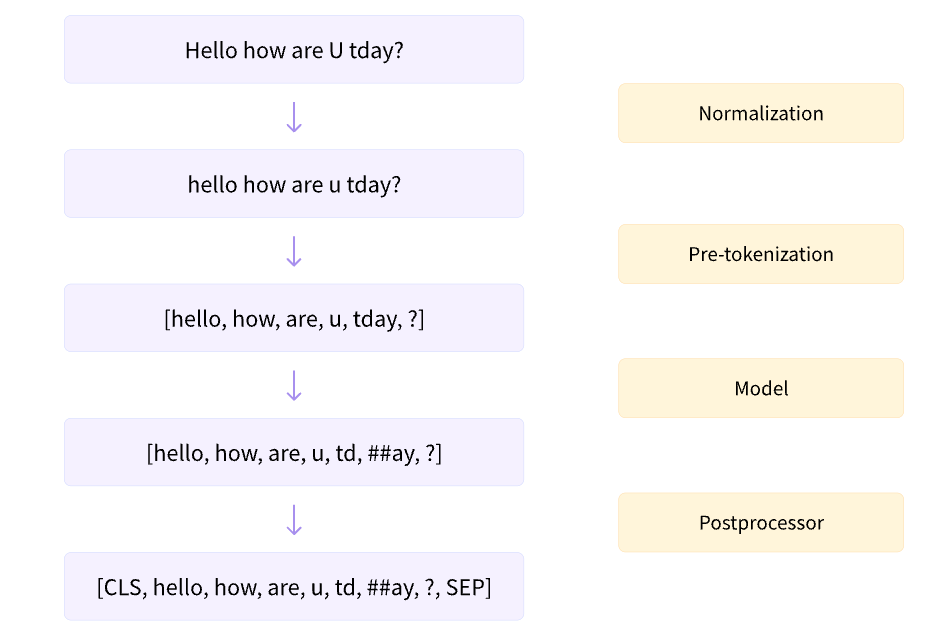

# NLP Tasks with HuggingFace APIs

## HuggingFace API

### Transformer Models

#### `pipeline` API Intro

* `pipeline` available tasks using pretrained transformer model ([Notebook](https://colab.research.google.com/github/huggingface/notebooks/blob/master/course/en/chapter1/section3.ipynb))
  * feature-extraction (get the vector representation of a text)
  * fill-mask
  * ner (named entity recognition)
  * question-answering
  * sentiment-analysis
  * summarization
  * text-generation
  * translation
  * zero-shot-classification

#### Transformer Models

* GPT-like (also called auto-regressive (decoder) Transformer models)
* BERT-like (also called auto-encoding Transformer models)
* BART/T5-like (also called sequence-to-sequence Transformer models)
* Training in a self-supervised fashion: Self-supervised learning is a type of training in which the objective is automatically computed from the inputs of the model
  * self-supervised training develops a statistical understanding of the language it has been trained on, but it’s not very useful for specific practical tasks
  * The general pretrained model then goes through a process called transfer learning. During this process, the model is fine-tuned in a supervised way — that is, using human-annotated labels — on a given task 
    * e.g. predicting the next words in a sentence having read the previous n words a.k.a causal language modeling)
    * e.g. masked language modeling
  * Pretraining is the act of training a model from scratch: the weights are randomly initialized, and the training starts without any prior knowledge.
  * Fine-tuning, on the other hand, is the training done after a model has been pretrained. To perform fine-tuning, you first acquire a pretrained language model, then perform additional training with a dataset specific to your task
* Transformer Architecture:
  * Encoder
  * Decoder
  * Attention layers: this layer will tell the model to pay specific attention to certain words in the sentence you passed it (and more or less ignore the others) when dealing with the representation of each word.
    * Note that the first attention layer in a decoder block pays attention to all (past) inputs to the decoder, but the second attention layer uses the output of the encoder. It can thus access the whole input sentence to best predict the current word. This is very useful as different languages can have grammatical rules that put the words in different orders, or some context provided later in the sentence may be helpful to determine the best translation of a given word.
* Encoder (only) Models:
  * Consist of layers: self-attention (multi-headed) and Bi-directional embeddings
  * Good for tasks that require understanding of the input, such as sentence/sequence classification (sentiment analysis) and named entity recognition. 
  * popular models: BERT, ALBERT, DistilBERT, ELECTRA, RoBERTa)
  * At each stage, the attention layers can access all the words in the initial sentence. These models are often characterized as having “bi-directional” attention, and are often called auto-encoding models
  * The words numerical representation (e.g. BERT has the default embedding size of 512 and the hidden size of 768) also consider the context around the word (bi-directional i.e. both left and right)
  * The pretraining of the models usually are: masking random words, Question and answer, reconstricturing intiial sentence, NLU (natural language understanding)
* decoder only model: 
  * Consist of layers: Auto-regressive, uni-directional, masked self-attention (masked on the right side, hide right context)
  * Good for generative tasks such as text generation, causal language modeling task, generating sequence
  * Popular: GPT, GPT-2, GPT-3, CTRL, Transformer XL
    * GPT-2 has a max left context of 1024 words
* Encoder-decoder models or sequence-to-sequence models
  * Good for generative tasks that require an input, such as translation or summarization.
  * Popular Models: T5, BART, mBART, Marian
  * Because encoder and decoder does not share weights, we can generate different text length based on tasks

  
### Using Transformer API 
  
#### `pipeline` behind the scene ([REF](https://colab.research.google.com/github/huggingface/notebooks/blob/master/course/en/chapter2/section2_pt.ipynb))

* Steps: Tokenizer => Model => Post Processing
* Data Path: Raw Text => Token IDs => Logits => Prediction (in probabilities)
  * Tokenizer (`AutoToeknizer.from_pretrained(checkpoint)`)
    * performs:
      * Splitting the input into words, subwords, or symbols (like punctuation) that are called tokens
      * Mapping each token to an integer
      * Adding additional inputs that may be useful to the model
      * Special tokens: e.g. [CLS], [SEP] => to add more details
      * All the steps match the steps in pretrain (i.e `from_pretrained()`)
    * Return a dictionary of input_ids and attention_mask (marks padding and tell model not to pay attention to it)

        ```python
        {'input_ids': tensor([[...]]), 'attention_mask': tensor([[...]])}
        ```

  * Model (`AutoModel*.from_pretrained(checkpoint)`)
    * Blocks: input => embeddings => layers => hidden states => head => model output
    * Perform:
      * Getting the weights from pretrained model checkpoint
      * given some inputs, it outputs what we’ll call hidden states, also known as features. For each model input, we’ll retrieve a high-dimensional vector representing the contextual understanding of that input by the Transformer model
      * The hidden states can be useful on their own, they’re usually inputs to another part of the model, known as the head. the different tasks could have been performed with the same architecture, but each of these tasks will have a different head associated with it.
      * The vector output by the Transformer module is usually large (high dimension for hidden size). It generally has three dimensions:
        * Batch size: The number of sequences (typically sentences) processed at a time
        * Sequence length: The length of the numerical representation of the sequence (16 in our example).
        * Hidden size: The vector dimension of each model input.
        * outputs of 🤗 Transformers models behave like namedtuples or dictionaries. You can access the elements by attributes or by key (e.g. outputs["last_hidden_state"]), or index if you know exactly where the thing you are looking for is (e.g. outputs[0]).
      * The model heads take the high-dimensional vector of hidden states as input and project them onto a different dimension. They are usually composed of one or a few linear layers
      * With `AutoModel.from_pretrained`, the model output is the hidden state, by adding different headers, the model outputs are for different tasks
        * AutoModel (retrieve the hidden states)
        * AutoModelForCausalLM
        * AutoModelForMaskedLM
        * AutoModelForMultipleChoice
        * AutoModelForQuestionAnswering
        * AutoModelForSequenceClassification
        * AutoModelForTokenClassification
        * and others 🤗
    * Postprocessing
      * The transformer model outputs are either in hidden state of logit dependening on the head
      * To get the final prediction, we apply additional postprocess such as softmax, etc to get the predicted probability
      * `model.config` contains details about labels (e.g. `model.config.id2label`)

**Note**: `from_pretrained()` will only download once and cache the model weights at (`~/.cache/huggingface/transformers`) for futre usage

#### Models

* `AutoModel` is a wrapper class allow us to instantiate any model with a checkpoint
* If we already know the model want, we can instantiate the model directly where config contains the model attributes
  * Note: This approach is not as flexible as `AutoModel` where the produce checkpoint-agnostic code that applies different architecture as long as checkpoint is trained for the similar tasks
* `save_pretrained(local_path)` would save model to a local path, it will save a `config.json` and a model binary file based on used deep learning framework

    ```python
    from transformer import BertConfig, BertModel

    config = BertConfig()

    # model is randomly initialized and untrained
    model = BertModel(config)
    
    # model is pretrained
    model = BertModel.from_pretrained("bert-base-cased")
    ```

#### Tokenizers

* Tokenizer trade-offs
  * Goal: find the most meaningfull, efficient representation
  * Word-based: split words with white space, with extra rules for punctuations
    * very large vocabulary size
    * We may have to limit the size of vocabulary and treat the rest as unknown (`[UNK]`) causing lost of information
  * Character-based
    * vocalbulary is much smaller than word-based
    * much fewer out-of-vocabulary (unknown) tokens
    * Hold less information then word-based, also varies based on different language
    * We need to use a very large amount of tokens to be processed by our model, i.e. very large sequence (token id numerical representation 
  * sub-word based:
    * Follow 2 principles:
      * frequently used words should not be split into smaller subwords
      * rare (complex) words should be decomposed into meaningful subwords
    * sub-word tokenization algorithm can identify the start of the words, prefix, subfix
      * Byte-level BPE, as used in GPT-2
      * WordPiece, as used in BERT
      * SentencePiece or Unigram, as used in several multilingual models (XLnet, ALBERT)

    Example: Note that decoder will construct subword to the full word. This behavior will be extremely useful when we use models that predict new text (either text generated from a prompt, or for sequence-to-sequence problems like translation or summarization).

    ```python
    from transformers import AutoTokenizer

    tokenizer = AutoTokenizer.from_pretrained("bert-base-cased")

    sequence = "Using a Transformer network is simple"
    tokens = tokenizer.tokenize(sequence)
    print(tokens) #['Using', 'a', 'transform', '##er', 'network', 'is', 'simple']

    ids = tokenizer.convert_tokens_to_ids(tokens)
    print(ids) #[7993, 170, 11303, 1200, 2443, 1110, 3014]

    decoded_string = tokenizer.decode([7993, 170, 11303, 1200, 2443, 1110, 3014])
    print(decoded_string) # 'Using a Transformer network is simple'
    ```

#### Handle Multiple Sequences

* Transformer model accept multiple sentences by default
  * Need to add a dimension if run for single sequence
* A batch is a 2-d tensor consist of multiple padded tokenized ids to maintain the right matrix shape
* Use attention layer to mask the padded token to ensure model can predict correctly
* Transformer model can handel sequence of up to 512 or 1024 tokens, we should truncate the sequence to meet the requirement
  * `sequence = sequence[:max_sequence_length]
* If we need longer requirement, we should consider models support long form (e.g. Longformer, LED)
* The above is already there in the tokenizer API when using `AutoTokenizer.from_pretrained()` and `tokenizer(my_sequence)`

token_type_ids. In this example, this is what tells the model which part of the input is the first sentence and which is the second sentence.
 

#### [E2E Basic Modeling Code Example](https://colab.research.google.com/github/huggingface/notebooks/blob/master/course/en/chapter2/section6_pt.ipynb)


### Fine-Tuning a Pretrained Model

* Steps:
  * Preparing large dataset from the hub
    * download datasets
    * preprocessing
  * Use high-level trainer API
  * Use a customer training loop
  * Leverage the accelerated library

* A simple end to end code example (pytorch)

  ```python
  import torch
  from transformers import AdamW, AutoTokenizer, AutoModelForSequenceClassification

  # Same as before
  checkpoint = "bert-base-uncased"
  tokenizer = AutoTokenizer.from_pretrained(checkpoint)
  model = AutoModelForSequenceClassification.from_pretrained(checkpoint)
  sequences = [
      "I've been waiting for a HuggingFace course my whole life.",
      "This course is amazing!",
  ]
  batch = tokenizer(sequences, padding=True, truncation=True, return_tensors="pt")
  batch["labels"] = torch.tensor([1, 1])
  optimizer = AdamW(model.parameters())
  loss = model(**batch).loss
  loss.backward()
  optimizer.step()
  ```

#### Download and Processing Data

* Processing Large Dataset from the hub
  * raw dataset format: `DatasetDict()`
  
  ```python
  from datasets import load_dataset

  raw_datasets = load_dataset("glue", "mrpc")
  raw_datasets
  
  ## Access DatasetDict
  raw_train_dataset = raw_datasets["train"]
  raw_train_dataset[0]
  ```

  ```python
  ## output
  DatasetDict({
      train: Dataset({
          features: ['sentence1', 'sentence2', 'label', 'idx'],
          num_rows: 3668
      })
      validation: Dataset({
          features: ['sentence1', 'sentence2', 'label', 'idx'],
          num_rows: 408
      })
      test: Dataset({
          features: ['sentence1', 'sentence2', 'label', 'idx'],
          num_rows: 1725
      })
  })
  ```

* ([GLUE](https://openreview.net/pdf?id=rJ4km2R5t7)) benchmark contain 10 dataset to benchmark text classification
  * Single sentnces (COLA, SST-2)
  * Pairs of sentences (MRPC, STS-B, QQP, HNLI, QNLI, RTE, WMLI)
  * This is one way to measure the goodness of fine-tuning
* Preprocessing dataset 
  * Based on the pretrained model and task, we determine the way to tokenize the text data (e.g. as a pair of sentences)
  * `AutoTokenizer` accept both one/pair of sentences, or a list single/pair of sentences as inputs
  * To read pair of sentences, we use `token_type_ids`

* Example1: Read raw text (a pair of sentences), tokenizer of a pretrained model checkpoints can prepare the right data for the model
  * `[CLS]` (input_id: 101),  `[SEP]` (input_id: 102) special tokens that the tokenizer make the model understand the data is a pair of sentences
  * In the form of `[CLS] sentence1 [SEP] sentence2 [SEP]`, aligning with `token_type_ids`
  * In general, we don’t need to worry about whether or not there are `token_type_ids` in your tokenized inputs: as long as you use the same checkpoint for the tokenizer and the model, everything will be fine as the tokenizer knows what to provide to its model.
  * Different checkpoint, however, may not always return `token_type_ids` due to how it was built during the pretraining

  ```python
  from transformers import AutoTokenizer

  checkpoint = "bert-base-uncased"
  tokenizer = AutoTokenizer.from_pretrained(checkpoint)
  inputs = tokenizer("This is the first sentence.", "This is the second one.")
  inputs
  
  # We get the ouptut where token_type_ids marks the 1st sentence vs 2nd sentence
  { 
    'input_ids': [101, 2023, 2003, 1996, 2034, 6251, 1012, 102, 2023, 2003, 1996, 2117, 2028, 1012, 102],
    'token_type_ids': [0, 0, 0, 0, 0, 0, 0, 0, 1, 1, 1, 1, 1, 1, 1],
    'attention_mask': [1, 1, 1, 1, 1, 1, 1, 1, 1, 1, 1, 1, 1, 1, 1]
  }
  
  # Decode the input_ids and align with token_type_id
  ['[CLS]', 'this', 'is', 'the', 'first', 'sentence', '.', '[SEP]', 'this', 'is', 'the', 'second', 'one', '.', '[SEP]']
  [      0,      0,    0,     0,       0,          0,   0,       0,      1,    1,     1,        1,     1,   1,       1]
  ```

* Example 2, next sentence prediction task where the model is provided pairs of sentences (with randomly masked tokens) and asked to predict whether the second sentence follows the first. feeding a batch of pair of sentences (assuming we select the right checkpoint that pretrained with pair of sentences)

  ```python
  tokenized_dataset = tokenizer(
    raw_datasets["train"]["sentence1"],
    raw_datasets["train"]["sentence2"],
    padding=True,
    truncation=True,
  )
  ```
  
  * Limitations of the approach
    * returning a dictionary (with keys: `input_ids`, `attention_mask`, and `token_type_ids`, and values that are lists of lists).
    * It will also only work if you have enough RAM to store your whole dataset during the tokenization (whereas the datasets from the 🤗 Datasets library are Apache Arrow files stored on the disk, so you only keep the samples you ask for loaded in memory).

* Example 3 (Better approach), use `Dataset.map()` method, it apply a function on each element of the datasets for any preprocessing task including tokenization
  * We can use `batched=True` in our call to map()
  * no padding defined here, discuss in the next example
  * To enable multiprocessing when applying your preprocessing function with map() by passing along a num_proc argument, this enabled by default with Tokenizers library

  ```python
  def tokenize_function(examples):
      return tokenizer(examples["sentence1"], examples["sentence2"], truncation=True)

  tokenized_datasets = raw_datasets.map(tokenize_function, batched=True)
  tokenized_datasets
  
  # new fields are added to the datasets
  DatasetDict({
    train: Dataset({
        features: ['attention_mask', 'idx', 'input_ids', 'label', 'sentence1', 'sentence2', 'token_type_ids'],
        num_rows: 3668
    })
    validation: Dataset({
        features: ['attention_mask', 'idx', 'input_ids', 'label', 'sentence1', 'sentence2', 'token_type_ids'],
        num_rows: 408
    })
    test: Dataset({
        features: ['attention_mask', 'idx', 'input_ids', 'label', 'sentence1', 'sentence2', 'token_type_ids'],
        num_rows: 1725
    })
  })
  ```

* Example 4. Dynamic Padding
  * Trade off: using the fixed shaped (always padding to a fixed length) vs dynamic padding where we padd to the max length of the current batch
  * Fixed length: TPU may prefer fixed shape, can be costly for short sentences, may cut off long sentence.
  
    ```python
    # fixed length

    from datasets import load_datasets
    from transformers import AutoTokenizer

    raw_datasets = load_dataset("glue", "mrpc")
    checkpoint = "bert-base-cased"
    tokenizer = AutoTokenizer.from_pretrained(checkpoint)

    def tokenize_function(examples):
      return tokenizer(examples["sentence1"], examples["sentence2"], padding="max_length", truncation=True, max_length=128)

    tokenized_datasets = raw_datasets.map(tokenize_function, batched=True)
    tokenized_datasets = tokenized_datasets.remove_columns(["idx", "sentence1", "sentence2"])
    tokenized_datasets = tokenized_datasets.rename_column(["label", "labels"])
    tokenized_datasets = tokenized_datasets.with_format("torch")

    # We can load fixed torch sized tensor
    from torch.utils.data import DataLoader
    train_dataloader = DataLoader(tokenized_datasets["train"], batch_size=16, shuffle=True)
    ```

  * Dynamic padding: improve training speed

    ```python
    # fixed length

    from datasets import load_datasets
    from transformers import AutoTokenizer

    raw_datasets = load_dataset("glue", "mrpc")
    checkpoint = "bert-base-cased"
    tokenizer = AutoTokenizer.from_pretrained(checkpoint)

    def tokenize_function(examples):
      return tokenizer(examples["sentence1"], examples["sentence2"], truncation=True)

    tokenized_datasets = raw_datasets.map(tokenize_function, batched=True)
    tokenized_datasets = tokenized_datasets.remove_columns(["idx", "sentence1", "sentence2"])
    tokenized_datasets = tokenized_datasets.rename_column(["label", "labels"])
    tokenized_datasets = tokenized_datasets.with_format("torch")

    # dynamic padding
    ## different torch size
    from transformers import DataCollatorWithPadding

    data_collator = DataCollatorWithPadding(tokenizer=tokenizer)

    from torch.utils.data import DataLoader

    train_dataloader = DataLoader(tokenized_datasets["train"], batch_size=16, shuffle=True, collate_fn=data_collator)
    ```

#### Trainer API

* Define a `TrainingArguments` class that will contain all the hyperparameters the Trainer will use for training and evaluation. 
* The only argument you have to provide is a `directory` where the trained model will be saved, as well as the checkpoints along the way.
* Define a model (based on tasks and pretrained model), e.g, we use `AutoModelForSequenceClassification` based on our task
  * Note BERT has not been pretrained on classifying pairs of sentences, so the head of the pretrained model has been discarded and a new head suitable for sequence classification is added instead  
  * The warnings indicate that some weights were not used (the ones corresponding to the dropped pretraining head) and that some others were randomly initialized (the ones for the new head)
* Define a trainer and pass the parameter from tokenization step
  * The default data_collator used by the Trainer will be a DataCollatorWithPadding
  * Default optimizer for trainer API is AdamW
  * Default learning rate scheduler is a linear decay from the maximum value (5e-5) to 0
* `trainer.train() will kick off the fine tuning
  * It reports the training loss every 500 steps. 
  * It won’t, however, tell you how well the model is performing unless
    * We define compute metrics for trainer
    * We define an evaluation strategy (steps, epoches)
* Evaluate
  * All 🤗 Transformers models will return the loss when labels are provided

  ```python
  from transformers import TrainingArguments
  from transformers import AutoModelForSequenceClassification

  training_args = TrainingArguments("test-trainer")

  model = AutoModelForSequenceClassification.from_pretrained(checkpoint, num_labels=2)

  from transformers import Trainer

  trainer = Trainer(
      model,
      training_args,
      train_dataset=tokenized_datasets["train"],
      eval_dataset=tokenized_datasets["validation"],
      data_collator=data_collator, # optional if we pass tokenizer which already use the same data_collator
      tokenizer=tokenizer,
  )
  trainer.train()

  # Evaluate after train
  predictions = trainer.predict(tokenized_datasets["validation"])

  import numpy as np

  preds = np.argmax(predictions.predictions, axis=-1)

  import evaluate

  metric = evaluate.load("glue", "mrpc")
  metric.compute(predictions=preds, references=predictions.label_ids)
  ```

* Have evaluation and train together
  * Define `evaluation_strategy` for `TrainingArguments()` 
  * Define `compute_metrics` function for `Trainer`

  ```python
  def compute_metrics(eval_preds):
      metric = evaluate.load("glue", "mrpc")
      logits, labels = eval_preds
      predictions = np.argmax(logits, axis=-1)
      return metric.compute(predictions=predictions, references=labels)

  training_args = TrainingArguments("test-trainer", evaluation_strategy="epoch")
  model = AutoModelForSequenceClassification.from_pretrained(checkpoint, num_labels=2)

  trainer = Trainer(
      model,
      training_args,
      train_dataset=tokenized_datasets["train"],
      eval_dataset=tokenized_datasets["validation"],
      data_collator=data_collator,
      tokenizer=tokenizer,
      compute_metrics=compute_metrics,
  )
  ```

#### Full Custom Training Loop (without using Trainer API)

* E2E Training loop with pytorch and leverage hugging face APIs (dataset, tokenizer, evalute)

  ```python
  # Preparing Data
  from datasets import load_dataset
  from transformers import AutoTokenizer, DataCollatorWithPadding

  raw_datasets = load_dataset("glue", "mrpc")
  checkpoint = "bert-base-uncased"
  tokenizer = AutoTokenizer.from_pretrained(checkpoint)


  def tokenize_function(example):
      return tokenizer(example["sentence1"], example["sentence2"], truncation=True)


  tokenized_datasets = raw_datasets.map(tokenize_function, batched=True)
  data_collator = DataCollatorWithPadding(tokenizer=tokenizer)

  # remove columns based on model requirement
  tokenized_datasets = tokenized_datasets.remove_columns(["sentence1", "sentence2", "idx"])
  tokenized_datasets = tokenized_datasets.rename_column("label", "labels")
  tokenized_datasets.set_format("torch")
  tokenized_datasets["train"].column_names
  # ["attention_mask", "input_ids", "labels", "token_type_ids"]

  # Using torch dataloader to produce batches 
  from torch.utils.data import DataLoader

  train_dataloader = DataLoader(
      tokenized_datasets["train"], shuffle=True, batch_size=8, collate_fn=data_collator
  )
  eval_dataloader = DataLoader(
      tokenized_datasets["validation"], batch_size=8, collate_fn=data_collator
  )

  for batch in train_dataloader:
    break
  {k: v.shape for k, v in batch.items()}
  #{'attention_mask': torch.Size([8, 65]),
  # 'input_ids': torch.Size([8, 65]),
  # 'labels': torch.Size([8]),
  # 'token_type_ids': torch.Size([8, 65])}

  # load model
  from transformers import AutoModelForSequenceClassification

  model = AutoModelForSequenceClassification.from_pretrained(checkpoint, num_labels=2)

  outputs = model(**batch)
  print(outputs.loss, outputs.logits.shape)
  # tensor(0.5441, grad_fn=<NllLossBackward>) torch.Size([8, 2])
  
  # define optimizer and lr scheduler and device
  import torch
  from transformers import AdamW
  from transformers import get_scheduler

  optimizer = AdamW(model.parameters(), lr=5e-5)
  num_epochs = 3
  num_training_steps = num_epochs * len(train_dataloader)
  lr_scheduler = get_scheduler(
      "linear",
      optimizer=optimizer,
      num_warmup_steps=0,
      num_training_steps=num_training_steps,
  )

  device = torch.device("cuda") if torch.cuda.is_available() else torch.device("cpu")
  model.to(device)
  device
  # device(type='cuda')

  # Training loop
  from tqdm.auto import tqdm

  progress_bar = tqdm(range(num_training_steps))

  model.train()
  for epoch in range(num_epochs):
      for batch in train_dataloader:
          batch = {k: v.to(device) for k, v in batch.items()}
          outputs = model(**batch)
          loss = outputs.loss
          loss.backward()

          optimizer.step()
          lr_scheduler.step()
          optimizer.zero_grad()
          progress_bar.update(1)

  # Evaluate
  import evaluate

  metric = evaluate.load("glue", "mrpc")
  model.eval()
  for batch in eval_dataloader:
      batch = {k: v.to(device) for k, v in batch.items()}
      with torch.no_grad():
          outputs = model(**batch)

      logits = outputs.logits
      predictions = torch.argmax(logits, dim=-1)
      metric.add_batch(predictions=predictions, references=batch["labels"])

  metric.compute()
  ```

### Sharing Models and Tokenizers

#### The hugging Face hub

* Model is hosted as a git repo
* Model is auto deployed as a hosted inference api
* Free if public 

#### User pretrained model

* Use pipeline API to run tasks directly
* Recommend to use `Auto*` classes for loading checkpoints to use model architecture since it is architecture-agnostic

#### Sharing pretrained models

There are three ways to go about creating new model repositories:

* Using the push_to_hub API (Best)
  * When you call `trainer.train()`, the Trainer will then upload your model to the Hub each time it is saved (here every epoch) in a repository in your namespace
  * Once your training is finished, you should do a final `trainer.push_to_hub()` to upload the last version of your model. 
  * It will also generate a model card with all the relevant metadata, reporting the hyperparameters used and the evaluation results

* Using the huggingface_hub Python library
* Using the web interface

#### Build a model card

* The model card usually starts with a very brief, high-level overview of what the model is for, followed by additional details in the following sections:

  * Model description
  * Intended uses & limitations
  * How to use
  * Limitations and bias
  * Training data
  * Training procedure
  * Evaluation results

### Dataset Library Indepth

#### Basic Steps to fine tuning a model

* Load a dataset from hugging Face Hub
* Preprocessing data with `Dataset.map()`
* Load and compute metrics

#### Working with local dataset

|data format | loading script | example |
| ---------- | -------------- | ------- |
|csv & tsv | csv | `load_dataset("csv", data_files="my_file.csv")` | 
|json | json | `load_dataset("json", data_files="my_file.json")` | 
|jsonl | json | `load_dataset("json", data_files="my_file.jsonl")` | 
|text | text | `load_dataset("text", data_files="my_file.txt")` | 
|picked dataframe | pandas | `load_dataset("pandas", data_files="my_file.pkl")` | 

* Example:

  ```python
  from datasets import load_dataset

  # load train data
  squad_it_dataset = load_dataset("json", data_files="SQuAD_it-train.json", field="data")

  squad_it_dataset

  DatasetDict({
    train: Dataset({
        features: ['title', 'paragraphs'],
        num_rows: 442
    })
  })
  
  # load both train and test
  data_files = {"train": "SQuAD_it-train.json", "test": "SQuAD_it-test.json"}
  squad_it_dataset = load_dataset("json", data_files=data_files, field="data")
  ```
* The data_files argument of the load_dataset() function is quite flexible and can be either a single file path, a list of file paths, or a dictionary that maps split names to file paths. You can also glob files that match a specified pattern according to the rules used by the Unix shell (e.g., you can glob all the JSON files in a directory as a single split by setting data_files="*.json")
* work with compressed files

```python
data_files = {"train": "SQuAD_it-train.json.gz", "test": "SQuAD_it-test.json.gz"}
squad_it_dataset = load_dataset("json", data_files=data_files, field="data")
```

* load remote dataset

```python
url = "https://github.com/crux82/squad-it/raw/master/"
data_files = {
    "train": url + "SQuAD_it-train.json.gz",
    "test": url + "SQuAD_it-test.json.gz",
}
squad_it_dataset = load_dataset("json", data_files=data_files, field="data")
```

#### Slide and dice dataset

* Example
  1. Download dataset

  ```bash
  !wget "https://archive.ics.uci.edu/ml/machine-learning-databases/00462/drugsCom_raw.zip"
  !unzip drugsCom_raw.zip
  ```
  
  2. load datatset

  ```python
  from datasets import load_dataset

  data_files = {"train": "drugsComTrain_raw.tsv", "test": "drugsComTest_raw.tsv"}
  # \t is the tab character in Python
  drug_dataset = load_dataset("csv", data_files=data_files, delimiter="\t")

  drug_sample = drug_dataset["train"].shuffle(seed=42).select(range(1000))
  # Peek at the first few examples
  drug_sample[:3]
  ```
  
  ```bash
  {'Unnamed: 0': [87571, 178045, 80482],
  'drugName': ['Naproxen', 'Duloxetine', 'Mobic'],
  'condition': ['Gout, Acute', 'ibromyalgia', 'Inflammatory Conditions'],
  'review': ['"like the previous person mention, I&#039;m a strong believer of aleve, it works faster for my gout than the prescription meds I take. No more going to the doctor for refills.....Aleve works!"', '"I have taken Cymbalta for about a year and a half for fibromyalgia pain. It is great\r\nas a pain reducer and an anti-depressant, however, the side effects outweighed \r\nany benefit I got from it. I had trouble with restlessness, being tired constantly,\r\ndizziness, dry mouth, numbness and tingling in my feet, and horrible sweating. I am\r\nbeing weaned off of it now. Went from 60 mg to 30mg and now to 15 mg. I will be\r\noff completely in about a week. The fibro pain is coming back, but I would rather deal with it than the side effects."', '"I have been taking Mobic for over a year with no side effects other than an elevated blood pressure.  I had severe knee and ankle pain which completely went away after taking Mobic.  I attempted to stop the medication however pain returned after a few days."'],
  'rating': [9.0, 3.0, 10.0],
  'date': ['September 2, 2015', 'November 7, 2011', 'June 5, 2013'],
  'usefulCount': [36, 13, 128]}
  ```
  
  3. split, process data

  ```python
  for split in drug_dataset.keys():
    assert len(drug_dataset[split]) == len(drug_dataset[split].unique("Unnamed: 0"))

  drug_dataset = drug_dataset.rename_column(
      original_column_name="Unnamed: 0", new_column_name="patient_id"
  )
  drug_dataset
  ```
  
  ```bash
  DatasetDict({
    train: Dataset({
        features: ['patient_id', 'drugName', 'condition', 'review', 'rating', 'date', 'usefulCount'],
        num_rows: 161297
    })
    test: Dataset({
        features: ['patient_id', 'drugName', 'condition', 'review', 'rating', 'date', 'usefulCount'],
        num_rows: 53766
    })
  })
  ```

  ```python
  def lowercase_condition(example):
    return {"condition": example["condition"].lower()}

  def compute_review_length(example):
    return {"review_length": len(example["review"].split())}

  drug_dataset = drug_dataset.filter(lambda x: x["condition"] is not None)
  drug_dataset.map(lowercase_condition) # AttributeError: 'NoneType' object has no attribute 'lower'
  drug_dataset = drug_dataset.map(compute_review_length)
  drug_dataset = drug_dataset.filter(lambda x: x["review_length"] > 30)
  drug_dataset = drug_dataset.map(lambda x: {"review": html.unescape(x["review"])}) # unescape html (&#039;)

  ```  

  * **`map()`** The Dataset.map() method takes a `batched` argument that, if set to True, causes it to send a batch of examples to the map function at once (the batch size is configurable but defaults to 1,000).
  * When you specify batched=True the function receives a dictionary with the fields of the dataset, but each value is now a list of values, and not just a single value. (need to use list comprehension) The return value of Dataset.map() should be the same.
  * Using Dataset.map() with batched=True will be essential to unlock the speed of the “fast” tokenizers


### Tokenizers Library Indepth

#### Intro

* Goal: train a brand ndew tokenizer on corpus of text in the use case where we want to train a model from scratch without using the same tokenizer as the pretrained model
  * if a language model is not in your language
  * if your corpus is very different
* topics:
  * Train a new toeknizer similar to the one used by a given checkpoint a new corpus of text
  * Special feature of fast toeknizers
  * difference between main subword toeknization alogithms
  * Build a tokenizer from scratch

#### Train a new tokenizer from old

* Most of transformer use subword tokenization algorithm to find the most frequently used subwords in the corpus at hand which require training
* Training a tokenizer is not the same as training a model which is **stochastic** in natural. Training a tokenizer is statistical process that try to identify which subwords are the best for a given corpus and it is **deterministic**
* API to use: `AutoTokenizer.train_new_from_iterator()`
  * Need to transform dataset into an iterator of lists of texts
  * lists of texts => proces a batch of text at once
  * use generator as iterator => avoid loading the whole dataset into memory
  
    ```python
    # Generator with comprehension
    training_corpus = (
      raw_datasets["train"][i : i + 1000]["whole_func_string"]
      for i in range(0, len(raw_datasets["train"]), 1000
    )
    ```

  * **Note**: this function only works if the tokenizer you are using is a “fast” tokenizer. (written in rust)
    * [Transformer supports fast tokenizer](https://huggingface.co/docs/transformers/index#supported-frameworks)


#### Special features of fast tokenizers

* Fast tokenizers are written in **Rust** and wrapped in Python, we need to use `batched=True` to enable its speed with parallel processing
  * paralleization
  * offset mapping to keep track of orignial span of texts
* output of toeknizer is a a special BatchEncoding object (a sub class of dictionary) to enable methods of fast toeknizers
* Keep track of the original span of texts using offset mapping, if a token is at the start of a word or if two tokens are in the same word. We could rely on the ## prefix for that, but `#` only works for BERT-like tokenizers. If we use other tokenizer special character changes, fast tokenizer works for all type
  * Applied use cases: NER, POS, MLM (whole word masking)
    * word ID => whole word masking, token classification (NER), QA
    * offset mapping => token classification (NER), QA

  ```python
  from transformers import AutoTokenizer

  tokenizer = AutoTokenizer.from_pretrained("bert-base-cased")
  example = "North London is red."
  encoding = tokenizer(example)
  tokenizer.is_fast #True
  encoding.is_fast #True
  start, end = encoding.word_to_chars(3)
  example[start:end]
  ```

#### Token classification pipeline (NER)

* Task: the task is to identify which parts of the text correspond to entities like persons, locations, or organizations 
* using token classification pipeline: same as the text classification pipeline in preprocessing and model steps but more complex in post-processing step
  * tokenization => preprocessing => model => post processing
  * Instead of 1 label for the sentence, we getting 1 label for each tokens in the sentence
* The `aggregation_strategy` will change the score computed for each grouped entity
  * `simple`: uses the man of the scores of each token in a given entity (i.e. `groupby(entity).mean()``)
  * `first`: where the score of each entity is the score of the first token of that entity 
  * `max`: where the score of each entity is the maximum score of the tokens in that entity
  * `average`, where the score of each entity is the average of the scores of the words composing that entity (note that words and tokens may be different depending on the text)
* The label `B-XXX` indicates the token is at the beginning of an entity XXX and the label `I-XXX` indicates the token is inside the entity XXX.
* There are actually two formats for those B- and I- labels: IOB1 and IOB2. The IOB2 format (in pink below), is the one we introduced whereas in the IOB1 format (in blue), the labels beginning with B- are only ever used to separate two adjacent entities of the same type.

* Using pipeline

    ```python
    from transformers import pipeline

    # without grouping
    token_classifier = pipeline("token-classification")
    token_classifier("Arsenal FC is a football club and North London is red.")
    
    # with grouping
    token_classifier = pipeline("token-classification", aggregation_strategy="simple")
    token_classifier("Arsenal FC is a football club and North London is red.")
    ```

* without using pipeline

  ```python
  from transformers import AutoTokenizer, AutoModelForTokenClassification

  model_checkpoint = "dbmdz/bert-large-cased-finetuned-conll03-english"
  tokenizer = AutoTokenizer.from_pretrained(model_checkpoint)
  model = AutoModelForTokenClassification.from_pretrained(model_checkpoint)

  example = "My name is Qian and I work at Arsenal in London."
  inputs = tokenizer(example, return_tensors="pt")
  outputs = model(**inputs)
  
  print(inputs["input_ids"].shape) # torch.Size(1, 19)
  print(outputs.logits.shape) # torch.Size(1, 19, 9)


  # without grouping
  import torch
  probabilities = torch.nn.functional.softmax(outputs.logits, dim=-1)[0].tolist()
  predictions = outputs.logits.argmax(dim=-1)[0].tolist()

  results = []
  inputs_with_offsets = tokenizer(example, return_offsets_mapping=True)
  tokens = inputs_with_offsets.tokens()
  offsets = inputs_with_offsets["offset_mapping"]

  for idx, pred in enumerate(predictions):
      label = model.config.id2label[pred]
      if label != "O":
        start, end = offset[idx]
        results.append(
              {"entity": label, 
              "score": probabilities[idx][pred], 
              "word": tokens[idx],
              "start": start,
              "end": end,
              }
          )

  print(results)
  
  # with grouping
  import numpy as np
  
  results = []
  inputs_with_offsets = tokenizer(example, return_offsets_mapping=True)
  tokens = inputs_with_offsets.tokens()
  offsets = inputs_with_offsets["offset_mapping"]
  
  idx = 0
  while idx < len(predictions):
      pred = predictions[idx]
      label = model.config.id2label[pred]
      if label != "O":
          # Remove the B- or I-
          label = label[2:]
          start, _ = offsets[idx]
  
          # Grab all the tokens labeled with I-label
          all_scores = []
          while (
              idx < len(predictions)
              and model.config.id2label[predictions[idx]] == f"I-{label}"
          ):
              all_scores.append(probabilities[idx][pred])
              _, end = offsets[idx]
              idx += 1
  
          # The score is the mean of all the scores of the tokens in that grouped entity
          score = np.mean(all_scores).item()
          word = example[start:end]
          results.append(
              {
                  "entity_group": label,
                  "score": score,
                  "word": word,
                  "start": start,
                  "end": end,
              }
          )
      idx += 1
  
  print(results
  ```

#### Fast Tokenizers in QA pipelines

* We can use QA pipeline which has the same step as other pipelines
* Unlike the other pipelines, which can’t truncate and split texts that are longer than the maximum length accepted by the model (and thus may miss information at the end of a document), this pipeline can deal with very long contexts and will return the answer to the question even if it’s at the end
* Use a AutoModel to QA task:
  * we tokenize the question and the context as a pair, with the question first.
  * Models for question answering work a little differently from other models. The model has been trained to predict the index of the token starting the answer and the index of the token where the answer ends. This is why QA models don’t return one tensor of logits but two: one for the logits corresponding to the start token of the answer, and one for the logits corresponding to the end token of the answer. (i.e. The goal is to find which token has the highest probability to be the first words of the ansers, which token has the highest probability to be the last word of the answer)

    ```python
    from transformers import AutoTokenizer, AutoModelForQuestionAnswering

    model_checkpoint = "distilbert-base-cased-distilled-squad"
    tokenizer = AutoTokenizer.from_pretrained(model_checkpoint)
    model = AutoModelForQuestionAnswering.from_pretrained(model_checkpoint)

    inputs = tokenizer(question, context, return_tensors="pt")
    outputs = model(**inputs)
    
    start_logits = outputs.start_logits
    end_logits = outputs.end_logits
    ```

  * To convert those logits into probabilities, we will apply a softmax function — but before that, we need to make sure we mask the indices that are not part of the context. The input is in `[CLS] question [SEP] context [SEP]`, so we need to mask the tokens of the question as well as the [SEP] token. We’ll keep the [CLS] token, however, as some QA models use it to indicate that the answer is not in the context.
  * To apply a softmax afterward, we need to replace the logits we want to mask with a large negative number. e.g. use -10000:

    ```python
    import torch
    
    sequence_ids = inputs.sequence_ids()
    # Mask everything apart from the tokens of the context
    mask = [i != 1 for i in sequence_ids]
    # Unmask the [CLS] token
    mask[0] = False

    # use [None] to do the same a unsqueezing/expanding a tensor axis to match logits tenor shape
    mask = torch.tensor(mask)[None] 
    
    start_logits[mask] = -10000
    end_logits[mask] = -10000
    
    # Apply softmax to get probability, dim=-1, since we apply softmax to the last dim where logit is.
    # grab index [0] to reduce dimension
    start_probabilities = torch.nn.functional.softmax(start_logits, dim=-1)[0]
    end_probabilities = torch.nn.functional.softmax(end_logits, dim=-1)[0]
    ```
    
  * To prevent start index larger than end index from argmax (meaning to avoid first word of the answer behind the last word in the text), We will compute the probabilities of each possible start_index and end_index where start_index <= end_index, then take the tuple (start_index, end_index) with the highest probability.
    * compute all the products `start_probabilities[start_index]×end_probabilities[end_index]` where start_index <= end_index.
    * Then we’ll mask the values where start_index > end_index by setting them to 0 (the other probabilities are all positive numbers). The `torch.triu()` function returns the upper triangular part of the 2D tensor passed as an argument, so it will do that masking for us because start_index <= end_index at the upper triangle 
    * With `argmax()`, PyTorch will return the index in the flattened tensor, we need to use the floor division // and modulus % operations to get the start_index and end_index:
    
    ```python
    scores = start_probabilities[:, None] * end_probabilities[None, :] # (67 x 1) * (1 x 67) = (67 x 67)
    scores = torch.triu(scores)
    max_index = scores.argmax().item()
    start_index = max_index // scores.shape[1] # start_index = 23 
    end_index = max_index % scores.shape[1] # end_index = 35
    print(scores[start_index, end_index])
    ```

  * we just need to convert to the character indices in the context. This is where the offsets will be super useful. We can grab them and use them like we did in the token classification task
    ```python
    inputs_with_offsets = tokenizer(question, context, return_offsets_mapping=True)
    offsets = inputs_with_offsets["offset_mapping"]

    start_char, _ = offsets[start_index]
    _, end_char = offsets[end_index]
    answer = context[start_char:end_char]
    ```
* Work with Long Context
  * We’ll need to truncate our inputs at that maximum length. 
  * We don’t want to truncate the question, only the context. Since the context is the second sentence, we’ll use the "only_second" truncation strategy. 
  * The problem that arises then is that the answer to the question may not be in the truncated context.
  *  To fix this, the question-answering pipeline allows us to split the context into smaller chunks, specifying the maximum length. To make sure we don’t split the context at exactly the wrong place to make it possible to find the answer, it also includes some overlap between the chunks.
    * Use tokenizer with `return_overflowing_tokens=True`
    * example below show the sentence split into chunks such that entry in the `inpus["input_ids"]` has at most 6 tokens with padding for the last entry, and has overlapping of 2 tokens
    ```python
    sentence = "This sentence is not too long but we are going to split it anyway."
    inputs = tokenizer(
      sentence, truncation=True, return_overflowing_tokens=True, max_length=6, stride=2
    )
    ```

#### Normalization and pre-tokenization

* Before splitting text into subtokens, the tokenizer performs: normalization and pre-tokenization



* Normalization: step involves general cleanup
  * removing whitespace, lowercasing, accents
  * apply unicode normalization (e.g. NFC or NFKC)
  * To acess underlying tokenizer's `normalizer`'s `normalizer_str()`

    ```python
    from transformers import AutoTokenizer

    tokenizer = AutoTokenizer.from_pretrained("bert-base-uncased")
    print(tokenizer.backend_tokenizer.normalizer.normalize_str("Héllò hôw are ü?"))
    ```
    * Different pretrained model's tokenizer perform normalization differently, it is recommenced to choose for the data

* Pre-tokenization
  * split text into small entities
  * keep track of the offset
  * Different model perform pre-tokenization differently
    * some will ignore multiple space replace with one
    * some will replace a specifc token such as `_`

* SentencePieces: A tokenization algorithm for preprocessing text
  * [Reference](https://github.com/google/sentencepiece)
  * SentencePiece is an unsupervised text tokenizer and detokenizer mainly for Neural Network-based text generation systems where the vocabulary size is predetermined prior to the neural model training
  * It considers the text as a sequence of Unicode characters, and replaces spaces with a special character, ▁. 
  * Used in conjunction with the Unigram algorithm
  * it doesn’t even require a pre-tokenization step, which is very useful for languages where the space character is not used (like Chinese or Japanese).
  * The other main feature of SentencePiece is **reversible tokenization**: since there is no special treatment of spaces, decoding the tokens is done simply by concatenating them and replacing the _s with spaces — this results in the normalized text
    * e.g. BERT Tokenizer removes repeating spaces, so its tokenization is not reversible

#### Subword Tokenization algorithms
* 3 main algorithms:
  * BPE
  * WordPieces
  * Unigram

| Model	| BPE	| WordPiece	| Unigram |
| --- | --- | --- | --- |
| Training	| Starts from a small vocabulary and learns rules to merge tokens	| Starts from a small vocabulary and learns rules to merge tokens	| Starts from a large vocabulary and learns rules to remove tokens |
| Training step	| Merges the tokens corresponding to the most common pair	| Merges the tokens corresponding to the pair with the best score based on the frequency of the pair, privileging pairs where each individual token is less frequent| Removes all the tokens in the vocabulary that will minimize the loss computed on the whole corpus | 
| Learns	| Merge rules and a vocabulary	| Just a vocabulary | 	A vocabulary with a score for each token |
| Encoding	| Splits a word into characters and applies the merges learned during training | Finds the longest subword starting from the beginning that is in the vocabulary, then does the same for the rest of the word	| Finds the most likely split into tokens, using the scores learned during training | 

* BPE (Byte-Pair Encoding Tokenization)
  * Byte-Pair Encoding (BPE) was initially developed as an algorithm to compress texts, and then used by OpenAI for tokenization when pretraining the GPT model
  * It is used by GPT, GTP-2, RoBerta, BART, and DeBERTa
      * If an example you are tokenizing uses a character that is not in the training corpus, that character will be converted to the unknown token, which would cause model to be poor analyizing text with e.g. emojis
      * The GPT-2 and RoBERTa tokenizers (which are pretty similar) have a clever way to deal with this: they don’t look at words as being written with Unicode characters, but with bytes. 
  * Training Steps: 
    1. Normalization
    2. Pre-tokenization
    3. Splitting the words into individual characters
       * computing the unique set of words used in the corpus (after the normalization and pre-tokenization steps are completed
       * building the vocabulary by taking all the symbols used to write those words. For real-world cases, that base vocabulary will contain all the ASCII characters, at the very least, and probably some Unicode characters as well
    4. Applying the merge rules learned in order on those splits
      *  add new tokens until the desired vocabulary size is reached by learning merges, which are rules to merge two elements of the existing vocabulary together into a new one

* WordPieces Tokenization
  * Algorithm google developed to pretrain BERT, also used in DistilBERT, MobileBERT, Funnel Transformers, and MPNET
  * Training is similar to BPE
    * Start from small vocab including special tokens
    * split to subwords and add prefix `##` (e.g. "word" => "w ##o ##r ##d" where `##` prefix indicate character inside a word)
    * to add vocab, it learn to merge by using 
      $$score = \frac{freq\ of\ pair}{(freq\ of\ first\ element)\times(freq\ of\ 2nd\ element)}$$
      
      the algorithm (how score is calculated) prioritizes the merging of pairs where the individual parts are less frequent in the vocabulary

    * repeat until reach vocab size
    * **Note**: Using `train_new_from_iterator()` on the same corpus won’t result in the exact same vocabulary. This is because the 🤗 Tokenizers library does not implement WordPiece for the training (since we are not completely sure of its internals), but uses BPE instead.

* Unigram Tokenization
  * Often used in SentencePiece, used by ALBERT, T5, mBART, Big Bird and XLNet
  * Opposite of BPE and WordPieces: starts from a big vocabulary and removes tokens from it until it reaches the desired vocabulary size
  * general steps:
    * Start with base vocabulary by take most common substrings in pre-tokenized word
    * At each step of training, computes a loss over the corpus given the current vocabulary. Then, for each symbol in the vocabulary, the algorithm computes how much the overall loss would increase if the symbol was removed, and looks for the symbols that would increase it the least. (i.e. the least impactful), and remove
    * Tune a parameter to get (10-20%) symbols associated with the lower loss, to reach the desir vocab site
  * Algorthms: `Unigram` model
    * considers each token to be independent of the tokens before it, i.e. the probability of token X given the previous context is just the probability of token X.
    * if we used a Unigram language model to generate text, we would always predict the most common token
    * In general, tokenizations with the least tokens possible will have the highest probability (because unigram has the same demonimantors for each token), corresponds to our intuition that splitting word into the least number of tokens possible
    * Use `Viterbi algorithm`. Essentially, we can build a graph to detect the possible segmentations of a given word by saying there is a branch from character a to character b if the subword from a to b is in the vocabulary, and attribute to that branch the probability of the subword. To find the path in that graph that is going to have the best score the Viterbi algorithm determines, for each position in the word, the segmentation with the best score that ends at that position.


## GenAI API

* Zero shot prompt
* Few shot prompt
* retrival-augmented few shot prompt
* Fine tuning


### Prompt engineering resources

https://learn.microsoft.com/en-us/semantic-kernel/prompt-engineering/
edx.org/course/ai-applications-and-prompt-engineering
https://www.coursera.org/learn/prompt-engineering
https://www.promptingguide.ai/
https://www.promptengineering.org/learn/
